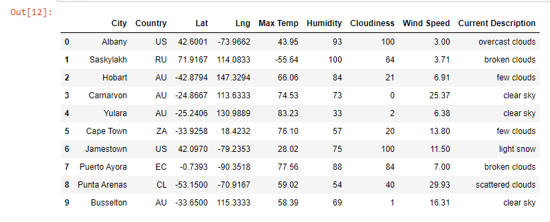
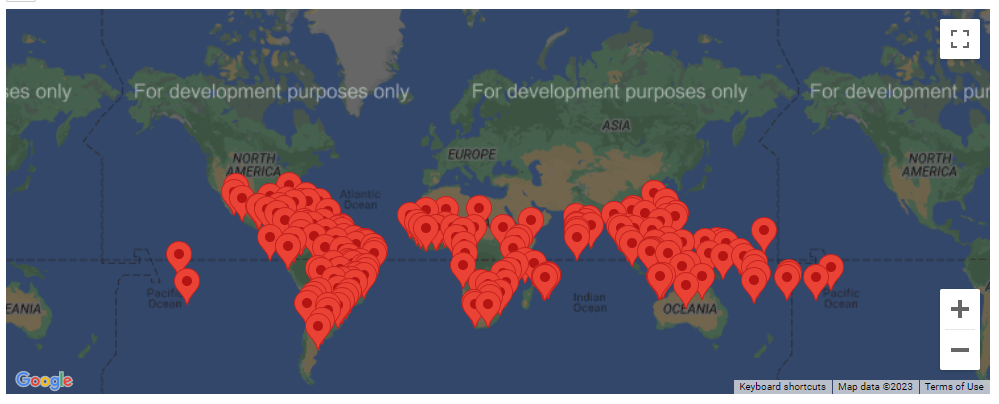

# World Weather Analysis

## Overview

PLANMYTRIP is a top travel technology company that specializes in internet-related services in the hotel and lodging industry.

## Purpose

Perform statistical calculations using linear regression on the weather parameters in the Northern and Southern hemispheres to predict the best time of year for people to plan their vacation. Subsequently, export the data, clean it, and use the weather data to choose the best cities for vacation based on certain weather criteria, and then map these cities using GeoViews and the Geoapify API.

## Deliverable 1: Retrieve Weather Data

Retrieve all of the following information from the API call:

Latitude and longitude
Maximum temperature
Percent humidity
Percent cloudiness
Wind speed
Weather description

## Deliverable 2: Create a Customer Travel Destinations Map 

Use Gmaps to create a map that displays a point for every city in the clean_hotel_df DataFrame. In the point for each city add:

The city name
The country code
The weather description
The point's size should be the maximum temperature for the city

## Deliverable 3: Create a Travel Itinerary Map

